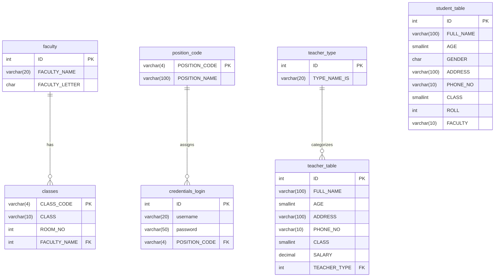

# Phase 1 — 現状分析アセスメント

> 生成日: 2026-06-07  
> 対象ソース: `SMS.cpp` / `sms_create.sql`

---

## 1. 機能一覧

### 1-1. 認証・ログイン

| 機能ID | 機能名 | 実装状況 | 備考 |
|--------|--------|----------|------|
| F-001 | ユーザーログイン | ✅ 実装済み | ハードコード認証（DB未使用） |
| F-002 | ログイン失敗10回でロック | ✅ 実装済み | カウンタはメモリのみ（再起動でリセット） |
| F-003 | ログアウト | ❌ 未実装 | exit() で強制終了 |

### 1-2. 管理者パネル（Admin）

| 機能ID | 機能名 | 実装状況 | 備考 |
|--------|--------|----------|------|
| F-010 | 生徒・教師の登録 | ⚠️ 部分実装 | 入力フォームあり、DB保存クエリ不完全 |
| F-011 | 記録の編集 | ⚠️ 部分実装 | ID入力のみ、更新処理なし |
| F-012 | 記録の削除 | ❌ スタブのみ | `cout << "Edit By delete"` のみ |
| F-013 | 記録の閲覧 | ❌ スタブのみ | `cout << "view By ADMIN"` のみ |
| F-014 | 経理（Accountancy） | ❌ スタブのみ | `cout << "accountant By ADMIN"` のみ |
| F-015 | プッシュ通知 | ❌ スタブのみ | `cout << "push By ADMIN"` のみ |

### 1-3. 教師パネル（Teacher）

| 機能ID | 機能名 | 実装状況 | 備考 |
|--------|--------|----------|------|
| F-020 | 生徒登録 | ⚠️ 部分実装 | Admin の `registeration(2)` を流用 |
| F-021 | 記録の編集 | ❌ スタブのみ | 空実装 |
| F-022 | 記録の削除 | ❌ スタブのみ | 空実装 |
| F-023 | 記録の閲覧 | ❌ スタブのみ | 空実装 |
| F-024 | 出席管理 | ❌ スタブのみ | 空実装（メニュー表示のみ） |
| F-025 | 成績表（Marksheet） | ❌ スタブのみ | 空実装 |
| F-026 | プッシュ通知 | ❌ スタブのみ | 空実装 |

### 1-4. 生徒パネル（Student）

| 機能ID | 機能名 | 実装状況 | 備考 |
|--------|--------|----------|------|
| F-030 | 情報更新 | ❌ スタブのみ | `registeration(2)` 呼び出しのみ |
| F-031 | 詳細閲覧 | ❌ スタブのみ | 空実装 |
| F-032 | 請求書（Bill） | ❌ スタブのみ | 空実装 |
| F-033 | 成績表閲覧 | ❌ スタブのみ | 空実装 |
| F-034 | 出席確認 | ❌ スタブのみ | 空実装 |
| F-035 | 試験スケジュール | ❌ スタブのみ | 空実装 |
| F-036 | お知らせ閲覧 | ❌ スタブのみ | 空実装 |
| F-037 | プッシュ通知 | ❌ スタブのみ | 空実装 |

### 1-5. その他

| 機能ID | 機能名 | 実装状況 | 備考 |
|--------|--------|----------|------|
| F-040 | Azure SQL DB 接続 | ✅ 実装済み | ODBC Driver 17、接続文字列ハードコード |
| F-041 | 登録番号表示 | ⚠️ 部分実装 | クエリが `name = 'alok'` で固定 |

---

## 2. データモデル

### 2-1. テーブル定義



### 2-2. テーブルの問題点

| テーブル | 問題 |
|---------|------|
| `credentials_login` | `password` が `varchar(50)` — 平文保存 |
| `student_table` | `credentials_login` との外部キーなし — ユーザーとデータが分離不能 |
| `teacher_table` | `GENDER` カラムなし（`student_table` にはある） |
| `classes` | `FACULTY_NAME` カラム名が int 型（ミスマッチ） |
| SQL DDL末尾 | `drop table teacher_table` が含まれており、実行すると即座にデータ消失 |
| SQL DDL末尾 | 不完全な `insert into teacher_table ... values('"++..."')` が含まれる |

---

## 3. 移行リスク分析

### 🔴 HIGH（即時対応必須）

| リスクID | リスク | 該当箇所 | 対応方針 |
|---------|--------|----------|---------|
| R-001 | **ハードコードパスワード** | `Login` クラス: `temp_password = "123"` など3アカウント | ASP.NET Core Identity に完全置換。DB登録フローを実装 |
| R-002 | **平文パスワード保存** | `credentials_login.password varchar(50)` | Identity の PasswordHasher を使用。カラムを `PasswordHash nvarchar(max)` に変更 |
| R-003 | **SQL インジェクション** | `snprintf(reg_qurey, ..., "insert into uid ... '%s','%s'", uname, pname)` | EF Core パラメータバインドに全置換 |
| R-004 | **接続文字列ハードコード** | `SQLDriverConnect(... "SERVER=demo-cpp01-sql-lgoqgnw2z3wxs.database.windows.net..."` | Azure App Service 環境変数 / Key Vault に移動 |

### 🟡 MEDIUM（移行時に対応）

| リスクID | リスク | 該当箇所 | 対応方針 |
|---------|--------|----------|---------|
| R-005 | **Windows API 依存** | `SetConsoleCursorPosition`, `keybd_event`, `_getch`, `Sleep`, `system("CLS")` など | Web UI（Razor Pages）に全置換。UI操作コードは不要 |
| R-006 | **`goto` 文の多用** | `goto re_try_login`, `goto re_try_teacher` など各所 | フォームバリデーション + リダイレクトに置換 |
| R-007 | **`drop table teacher_table` が DDL に含まれる** | `sms_create.sql` 末尾 | EF Core Migration で管理。元 DDL は参照のみ |
| R-008 | **`exit(0)` による強制終了** | ログイン失敗・不正入力時 | Web アプリでは HTTP エラーレスポンスまたはリダイレクトに変換 |

### 🟢 LOW（設計上の考慮事項）

| リスクID | リスク | 該当箇所 | 対応方針 |
|---------|--------|----------|---------|
| R-009 | **ほとんどの機能が未実装** | Teacher・Student パネルの全機能がスタブ | 要件定義（Phase 2）で実装範囲を確定し新規実装 |
| R-010 | **ユーザーとエンティティのリレーション欠如** | `credentials_login` と `student_table` / `teacher_table` 間の FK なし | Identity の `AspNetUsers` に `StudentId` / `TeacherId` FK を追加 |
| R-011 | **ログイン失敗カウンターがメモリのみ** | `short int login_fail = 1` グローバル変数 | ASP.NET Core Identity のロックアウト機能で代替 |

---

## 4. 推奨アーキテクチャ

### 4-1. ターゲット構成

```
┌─────────────────────────────────────────────────────┐
│  GitHub Actions (CI/CD)                             │
│  push to main → build → test → deploy              │
└─────────────────────┬───────────────────────────────┘
                      │
┌─────────────────────▼───────────────────────────────┐
│  Azure App Service B1 (Linux)                       │
│  ASP.NET Core 8 Razor Pages                         │
│                                                     │
│  ┌──────────────┐  ┌──────────────┐                │
│  │ Razor Pages  │  │  Identity    │                │
│  │ (UI層)       │  │  (認証・認可) │                │
│  └──────┬───────┘  └──────┬───────┘                │
│         │                 │                         │
│  ┌──────▼─────────────────▼───────┐                │
│  │  Service Layer (ビジネスロジック) │                │
│  └──────────────┬────────────────┘                │
│                 │                                   │
│  ┌──────────────▼────────────────┐                │
│  │  EF Core 8 (Data Layer)       │                │
│  └──────────────┬────────────────┘                │
└─────────────────┼───────────────────────────────────┘
                  │
┌─────────────────▼───────────────────────────────────┐
│  Azure SQL Database Serverless                      │
│  sms-db-prod                                        │
└─────────────────────────────────────────────────────┘
```

### 4-2. エンティティ設計方針（移行後）

| 元テーブル | 移行後エンティティ | 変更点 |
|-----------|-----------------|--------|
| `credentials_login` | `AspNetUsers` (Identity) | PasswordHash に変更。POSITION_CODE → Roles に変換 |
| `student_table` | `Student` | `ApplicationUser` に FK 追加 |
| `teacher_table` | `Teacher` | `ApplicationUser` に FK 追加。GENDER カラム追加 |
| `faculty` | `Faculty` | 変更なし |
| `classes` | `Class` | `FACULTY_NAME` → `FacultyId` に修正 |
| `position_code` | → Identity Roles | `Admin` / `Teacher` / `Student` の3ロール |
| `teacher_type` | `TeacherType` | 変更なし |

### 4-3. 実装優先順位

```
Phase 6A: 基盤（Program.cs, Identity, DbContext, Migration）
  ↓
Phase 6B: データ層（エンティティ, Repository, Service）
  ↓
Phase 6C: 認証（Login / Register / Role-based Authorization）
  ↓
Phase 6D: CRUD（Student, Teacher, Faculty, Class の管理画面）
  ↓
Phase 6E: 拡張機能（Attendance, Marksheet, Notice）
  ↓
Phase 6F: テスト・デプロイ
```

---

## 5. 移行対象外（スコープ外）

| 項目 | 理由 |
|------|------|
| 経理（Accountancy）機能 | スタブのみで要件不明 — Phase 2 で確認 |
| プッシュ通知 | スタブのみで要件不明 — 将来の拡張として保留 |
| Windows フルスクリーン制御 | Web アプリに該当する概念なし |

---

## 6. 次のアクション（Phase 2 への引き渡し）

- [ ] R-009 を受けて、スタブ機能の実装範囲を要件定義で確定する
- [ ] Admin / Teacher / Student の各ロールで「誰が何をできるか」を明確化する
- [ ] `credentials_login` に格納予定だった既存ユーザーデータの移行戦略を決定する
- [ ] `drop table teacher_table` を含む元 DDL を使用しない旨を確認する
