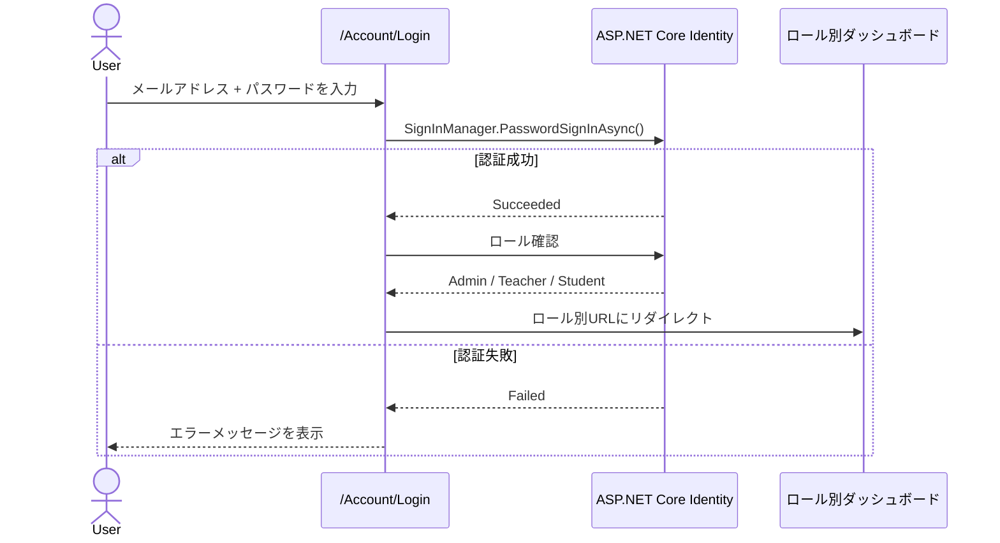

# Phase 3 — 設計ドキュメント（デモ最小版）

> 生成日: 2026-06-07  
> 参照: `docs/phase2-requirements.md`

---

## 1. アーキテクチャ概要

```
src/SmsWeb/
├── Data/
│   └── ApplicationDbContext.cs       # DbContext + Identity
├── Models/
│   ├── Student.cs                    # 生徒エンティティ
│   └── Attendance.cs                 # 出席エンティティ
├── Services/
│   ├── IStudentService.cs
│   ├── StudentService.cs
│   ├── IAttendanceService.cs
│   └── AttendanceService.cs
├── Pages/
│   ├── Account/
│   │   └── Login.cshtml              # SCR-001
│   ├── Admin/
│   │   └── Students/
│   │       ├── Index.cshtml          # SCR-002 生徒一覧
│   │       ├── Create.cshtml         # SCR-003 生徒登録
│   │       └── Edit.cshtml           # SCR-003 生徒編集
│   ├── Teacher/
│   │   ├── Students/
│   │   │   └── Index.cshtml          # SCR-004 生徒一覧（閲覧のみ）
│   │   └── Attendance/
│   │       └── Index.cshtml          # SCR-005 出席入力
│   └── Student/
│       └── Profile.cshtml            # SCR-006 プロフィール
├── Program.cs
└── SmsWeb.csproj
```

---

## 2. エンティティ設計

### 2-1. ApplicationUser（Identity 拡張）

```csharp
public class ApplicationUser : IdentityUser
{
    public int? StudentId { get; set; }
    public Student? Student { get; set; }

    public int? TeacherId { get; set; }
    // Teacher エンティティは今回デモスコープ外のため int のみ保持
}
```

### 2-2. Student

```csharp
public class Student
{
    public int Id { get; set; }              // identity(1001,1) に合わせて Seed で調整

    [Required]
    [MaxLength(100)]
    public string FullName { get; set; } = string.Empty;

    public short? Age { get; set; }

    [MaxLength(1)]
    public string? Gender { get; set; }      // "M" / "F"

    [MaxLength(100)]
    public string? Address { get; set; }

    [MaxLength(10)]
    public string? PhoneNo { get; set; }

    public short Class { get; set; }

    public int Roll { get; set; }

    [MaxLength(10)]
    public string? Faculty { get; set; }

    // ナビゲーションプロパティ
    public ICollection<Attendance> Attendances { get; set; } = new List<Attendance>();
    public ApplicationUser? User { get; set; }
}
```

### 2-3. Attendance

```csharp
public class Attendance
{
    public int Id { get; set; }

    public int StudentId { get; set; }
    public Student Student { get; set; } = null!;

    public DateOnly Date { get; set; }

    public bool IsPresent { get; set; }      // true=出席 / false=欠席
}
```

---

## 3. DbContext 設計

```csharp
public class ApplicationDbContext : IdentityDbContext<ApplicationUser>
{
    public ApplicationDbContext(DbContextOptions<ApplicationDbContext> options)
        : base(options) { }

    public DbSet<Student> Students => Set<Student>();
    public DbSet<Attendance> Attendances => Set<Attendance>();

    protected override void OnModelCreating(ModelBuilder builder)
    {
        base.OnModelCreating(builder);

        // Student の自動採番を 1001 開始に設定
        builder.Entity<Student>()
            .Property(s => s.Id)
            .UseIdentityColumn(seed: 1001, increment: 1);

        // Attendance の複合ユニーク制約（同一生徒・同一日は1件のみ）
        builder.Entity<Attendance>()
            .HasIndex(a => new { a.StudentId, a.Date })
            .IsUnique();

        // ApplicationUser ↔ Student の1対1リレーション
        builder.Entity<ApplicationUser>()
            .HasOne(u => u.Student)
            .WithOne(s => s.User)
            .HasForeignKey<ApplicationUser>(u => u.StudentId)
            .OnDelete(DeleteBehavior.SetNull);
    }
}
```

---

## 4. ルーティング設計

| URL | ページファイル | ロール制御 |
|-----|--------------|-----------|
| `/Account/Login` | `Pages/Account/Login.cshtml` | 認証不要 |
| `/Admin/Students` | `Pages/Admin/Students/Index.cshtml` | `[Authorize(Roles="Admin")]` |
| `/Admin/Students/Create` | `Pages/Admin/Students/Create.cshtml` | `[Authorize(Roles="Admin")]` |
| `/Admin/Students/Edit/{id}` | `Pages/Admin/Students/Edit.cshtml` | `[Authorize(Roles="Admin")]` |
| `/Admin/Students/Delete/{id}` | `Pages/Admin/Students/Index.cshtml`（POST） | `[Authorize(Roles="Admin")]` |
| `/Teacher/Students` | `Pages/Teacher/Students/Index.cshtml` | `[Authorize(Roles="Teacher")]` |
| `/Teacher/Attendance` | `Pages/Teacher/Attendance/Index.cshtml` | `[Authorize(Roles="Teacher")]` |
| `/Student/Profile` | `Pages/Student/Profile.cshtml` | `[Authorize(Roles="Student")]` |

### ログイン後のリダイレクト先

```csharp
// Program.cs
options.LoginPath = "/Account/Login";
options.AccessDeniedPath = "/Account/Login";

// Login PageModel: ロール別リダイレクト
if (await userManager.IsInRoleAsync(user, "Admin"))
    return RedirectToPage("/Admin/Students/Index");
if (await userManager.IsInRoleAsync(user, "Teacher"))
    return RedirectToPage("/Teacher/Students/Index");
return RedirectToPage("/Student/Profile");
```

---

## 5. 認証フロー



---

## 6. シードデータ設計（デモ用初期データ）

```csharp
// デモ用アカウント（Program.cs の SeedAsync で作成）
// パスワードは環境変数から取得し、コードにハードコードしない

Role: Admin  → admin@sms.demo  (パスワード: 環境変数 SEED_ADMIN_PASSWORD)
Role: Teacher → teacher@sms.demo (パスワード: 環境変数 SEED_TEACHER_PASSWORD)
Role: Student → student@sms.demo (パスワード: 環境変数 SEED_STUDENT_PASSWORD)
              → Student レコード: FullName="Demo Student", Class=1, Roll=1001
```

---

## 7. 次のアクション（Phase 4 への引き渡し）

- [ ] TASK 分解: エンティティ作成 → DbContext → Migration → Pages の順で実装タスクを定義する
- [ ] `SmsWeb.csproj` の NuGet パッケージ一覧を確定する
  - `Microsoft.AspNetCore.Identity.EntityFrameworkCore`
  - `Microsoft.EntityFrameworkCore.SqlServer`
  - `Microsoft.EntityFrameworkCore.Tools`
